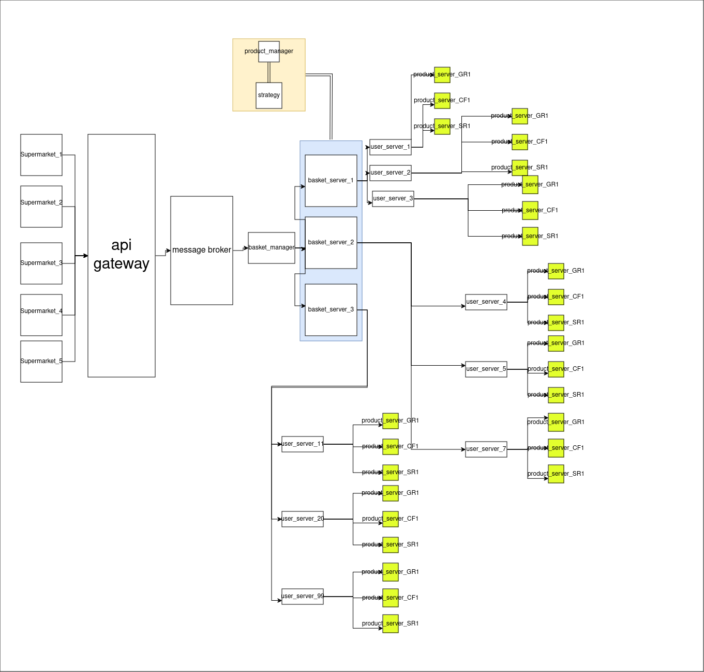

# SupermarketUmberlla

# supermarket_model

Here a model of the system that process chain of super markets. It's good model to practice with Elixir concurrency nature.

# Project Architecture

Below is the architecture diagram for the project:

# Architecture Overview

In the architecture, we have multiple supermarkets making requests to a shared API gateway, which then distributes the requests via a message broker to the `BasketManager`.

We also have a cluster of `BasketServers`. For scalability, I included these `basket_server` nodes in a cluster. The `BasketServer` nodes, through the `DynamicUserBasketSupervisor`, create `UserBasketServer` instances to manage individual users' baskets on separate servers (using `GenServer`, as we need to maintain state and support future clustering for scalability).

Each `UserBasketServer` in turn creates its own `ProductServers` via the `DynamicProductSupervisor`. This means that a user's basket is grouped by product types, and a separate server is created for each product type (again using `GenServer` to maintain state, with the potential for future scaling and clustering).

The `ProductServer` instances are responsible for calculating the basket's cost.

Regarding dynamic price calculation rules, the system is designed to load dynamic scripts containing the necessary strategy. This allows us to change the pricing strategy at runtime by loading a new strategy from a separate script.

---

## Why Choose an Umbrella Project?

As I read in the excellent book *Clean Architecture* by Robert C. Martin (I can't quote exactly, but the essence is that a good architect delays decision-making until the point when the reality becomes valuable), an umbrella project allows us to increase development speed while providing a good level of isolation. I aimed to create low-coupling, high-cohesion applications that can be easily divided or replaced as needed. It also allows us to work with the project as a monolith in the early stages and then break it into microservices as we grow.

---

## What Are the Downsides of This Model at This Stage?

- **Test Failures**: Sometimes tests fail due to the concurrency nature of the system. We need better debugging tools and improved tests.
- **Limited Logs**: The logs are quite limited, making debugging more challenging. And a lot of errors from tests that simulate server crashes and timeouts which also get in the way.
- **Dynamic Module Loading**: There is a warning about the module already being compiled when dynamically loading strategies. We need to implement a system that checks the memory for loaded modules to avoid conflicts.

---

## How to run?

Just build docker via `docker build -t umbrella_project_test .` and run `docker run --rm -it umbrella_project_test  mix test` to run some mix command or if you want go into container - run `docker run --rm -it umbrella_project_test`

---

## Contributions

Any contributions are welcome! If you have suggestions, improvements, or fixes, feel free to open a pull request or submit an issue.
